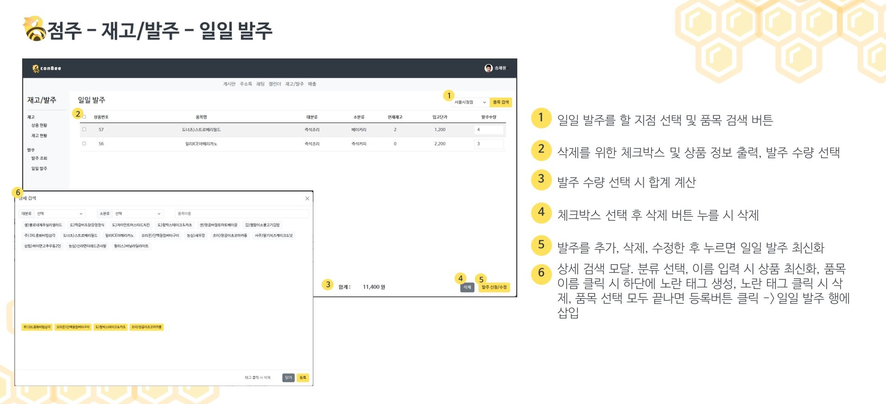
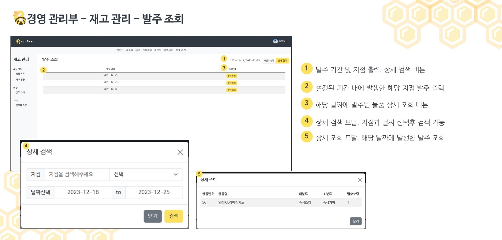

# 🐝 Conbee
- ERP & 그룹웨어 웹 애플리케이션
- [상세보기](https://github.com/Bee-Keepers/conbee)

## 😄 나의 역할
- 저는 프로젝트에서 ERP 시스템 부분을 맡았습니다.
- 변화하는 편의점 재고의 데이터 흐름을 중점적으로 설계 및 구현했습니다.
- 본사에서는 모든 지점의 재고 흐름을 볼 수 있는 시스템을 설계했습니다.
- 그룹웨어 시스템과 결합하여 본사에서 발주 기안서를 작성하고 결재를 받으면 본사(창고)의 재고가 늘어나는 시스템을 도입했습니다.
- 데이터를 분석할 때 페이지네이션 때문에 흐름이 끊기는 경우를 줄이고자 무한 스크롤 방식으로 구현했습니다.
- 트리거를 사용해 데이터를 동기화 시켰습니다.

## 🖥️ 세부 기능
### 메인 페이지
- 직책에 따라 메인 페이지에 나타나는 구성과 메뉴가 다릅니다.
- 출력되는 데이터들은 무한 스크롤로 구현하였습니다.
  

<video src="https://github.com/FireCurry/Portfolio/assets/141403823/c0697f69-6b63-46a9-9178-7866d8d54dc7"/>

---

### POS
- 지점 선택, 품목 선택, 수량 선택 후 결제하면 입출고 내역에 입력되게 됩니다.
- 트리거에 의해 지점의 재고가 동기화 되게 됩니다.

https://github.com/FireCurry/Portfolio/assets/141403823/386cc156-bd0c-44c4-a9e5-af06d8a87941

---

### 발주
- 발주 테이블은 하루 단위로 관리되고 스케쥴러에 의해 특정 시간에 일괄 발주가 진행됩니다.

https://github.com/FireCurry/Portfolio/assets/141403823/157a8e4b-265c-49fc-a207-52f762c00844

---

### 매출
- 다양한 검색 조건을 이용해서 지점의 매출과 입출고 내역을 확인할 수 있습니다.

https://github.com/FireCurry/Portfolio/assets/141403823/1ea0de2d-28c1-437a-afac-9fba8eba902c

---

### 본사 기능
- 각 지점으로 출고되는 물건의 가격(본사에서 지점에 파는 가격)을 조정할 수 있습니다.
- 모든 지점의 발주, 입출고 내역, 매출을 다양한 검색 조건을 이용해서 조회할 수 있습니다.
- 그룹웨어의 발주 기안서를 이용해 본사 창고에 채울 재고를 발주할 수 있습니다.

https://github.com/FireCurry/Portfolio/assets/141403823/05f61674-e35a-430e-bf10-bb90ec4184c8

https://github.com/FireCurry/Portfolio/assets/141403823/da8e0204-7626-4535-953f-65222aed2b57

## 📖참여소감
- 작업량 할당이 프로젝트 완성도에 주는 영향을 알았습니다.
- 저번 프로젝트의 경험을 기반으로 이번 프로젝트의 목표 설정과 기초는 잘 다졌습니다. 작업도 순차적으로 잘 진행이 되었습니다. 하지만 깨달은 것이 있다면 역할의 분담입니다. 처음에 역할을 분담할 때 팀원의 작업 속도를 고려해 역할을 분배했다면 더 좋은 스케쥴을 소화했을 것이라고 느꼈습니다. 그렇지 않다보니 먼저 한 사람은 시간이 붕 뜨고 아직 못 한 사람은 시간이 촉박한 그런 상황이 발생했고 또 도움을 주고 싶어도 다른 사람이 작업하던 것을 도와주기엔 힘든 부분이 있어서 난감했습니다.
