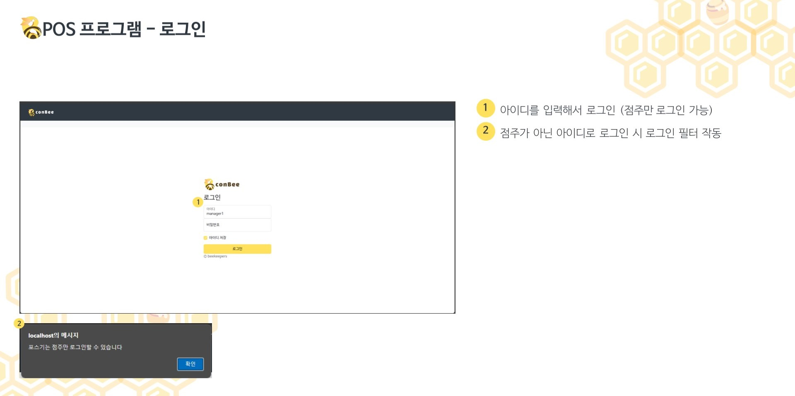
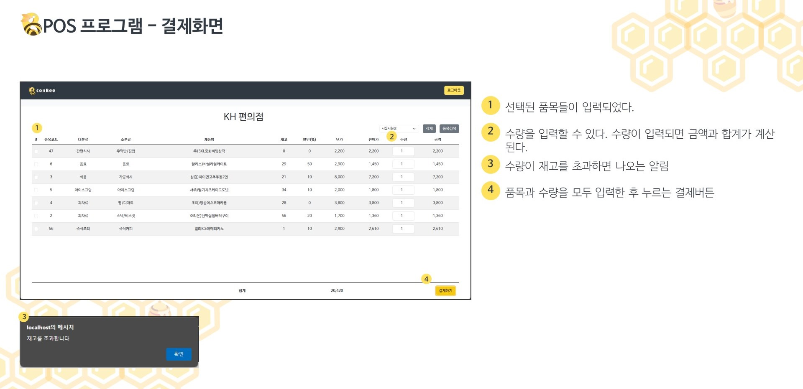
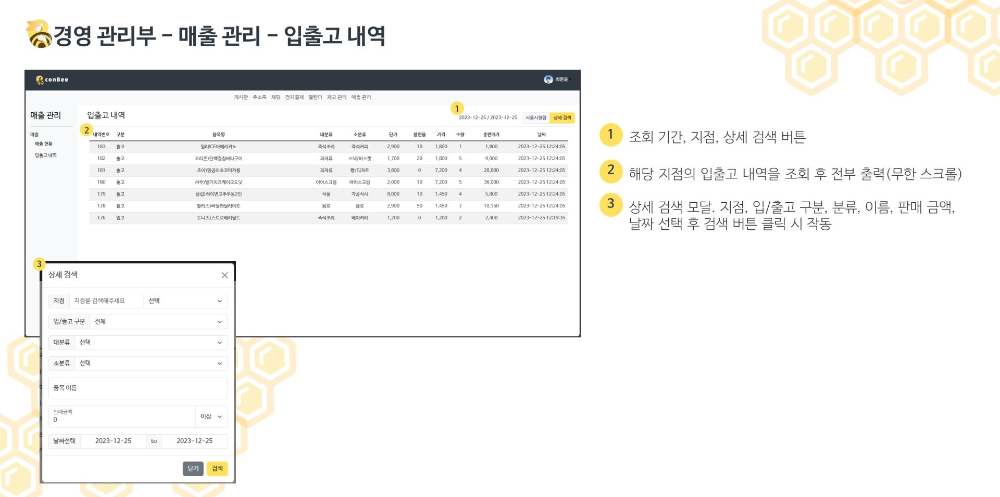

# 🐝 Conbee
## ERP & 그룹웨어 웹 애플리케이션

로그인 한 사람의 직책에 따라 나오는 화면이 달라진다

## 나의 역할
- 저는 프로젝트에서 ERP 시스템 부분을 맡았습니다.
- 변화하는 편의점 재고의 데이터 흐름을 중점적으로 설계 및 구현했습니다.
- 본사에서는 모든 지점의 재고 흐름을 볼 수 있는 시스템을 설계했습니다.
- 그룹웨어 시스템과 결합하여 본사에서 발주 기안서를 작성하고 결재를 받으면 본사(창고)의 재고가 늘어나는 시스템을 도입했습니다.
- 데이터를 분석할 때 페이지네이션 때문에 흐름이 끊기는 경우를 줄이고자 무한 스크롤 방식으로 구현했습니다.
- 트리거를 사용해 데이터를 동기화 시켰습니다.

## 세부 기능
### 메인 페이지

<video src="https://github.com/FireCurry/Portfolio/assets/141403823/c0697f69-6b63-46a9-9178-7866d8d54dc7"/>

### POS

https://github.com/FireCurry/Portfolio/assets/141403823/386cc156-bd0c-44c4-a9e5-af06d8a87941

### 발주

https://github.com/FireCurry/Portfolio/assets/141403823/157a8e4b-265c-49fc-a207-52f762c00844

### 재고/매출

https://github.com/FireCurry/Portfolio/assets/141403823/1ea0de2d-28c1-437a-afac-9fba8eba902c

### 본사 기능

https://github.com/FireCurry/Portfolio/assets/141403823/05f61674-e35a-430e-bf10-bb90ec4184c8

https://github.com/FireCurry/Portfolio/assets/141403823/da8e0204-7626-4535-953f-65222aed2b57

