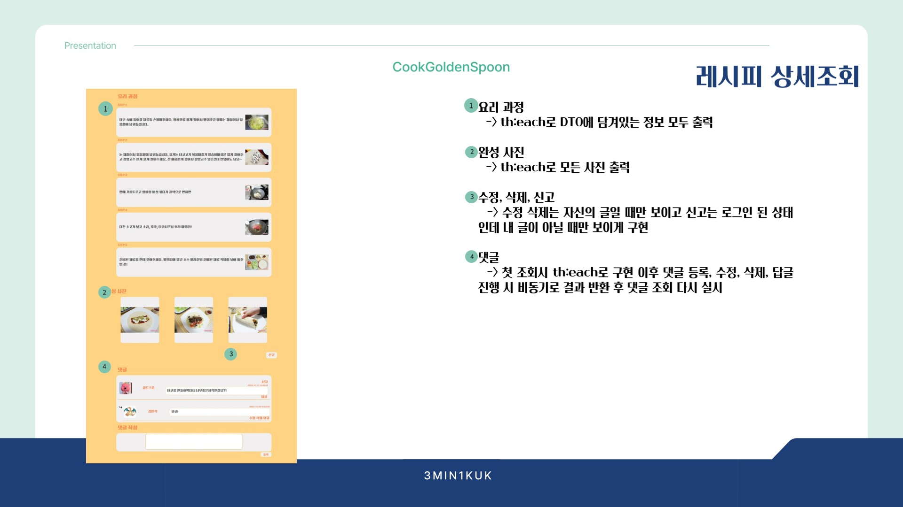
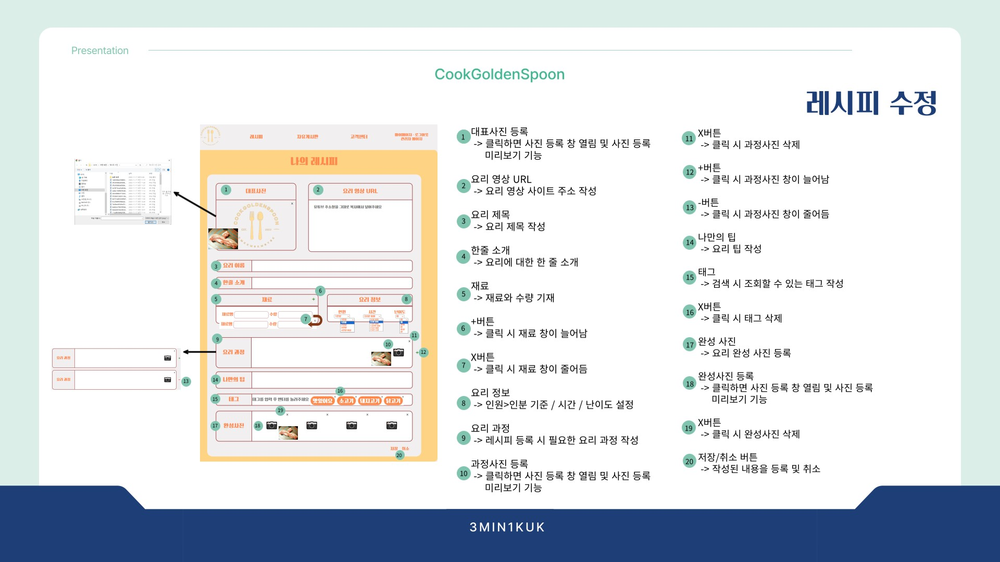

### 레시피 공유 웹 애플리케이션

<video src="https://github.com/FireCurry/Portfolio/blob/main/CookGoldenSpoon/video/%EB%A7%88%EC%9D%B4%ED%8E%98%EC%9D%B4%EC%A7%80.mp4"/>

<video src="./video/레시피 수정.mp4"/>
<video width="320" height="240" controls>
  <source src="./video/마이페이지.mp4" type="video/mp4">
  Your browser does not support the video tag.
</video>
